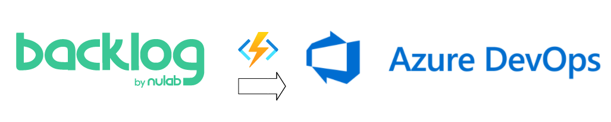

# bklg2devops-func

backlog.com の登録課題を Webhook で Azure Functions で捌いて Azure DevOps に連携する



## 環境変数 の指定 

pytest 実行時も指定が必要

``` shell
export DEVOPS_ORG=<ORG>
export DEVOPS_PROJECT_ID=<PROJECT_ID>
export DEVOPS_PAT=<PAT>
export BACKLOG_ORG=<BACKLOG_PROJECT_KEY>
```

- DEVOPS_ORG
  - https://dev.azure.com/{DEVOPS_ORG} に該当
- DEVOPS_PROJECT_ID
  - https://dev.azure.com/{DEVOPS_ORG}/{DEVOPS_PROJECT_ID} に該当
- DEVOPS_PAT
  - DevOps の Personal Access Token
- BACKLOG_ORG
  -  https://{BACKLOG_ORG}.backlog.com/ に該当

## deploy and run
- VSCode から deploy する
- Azure Functions の認証は API Key ("code" param) が設定されています
     - authLevel は function で設定してある
    
